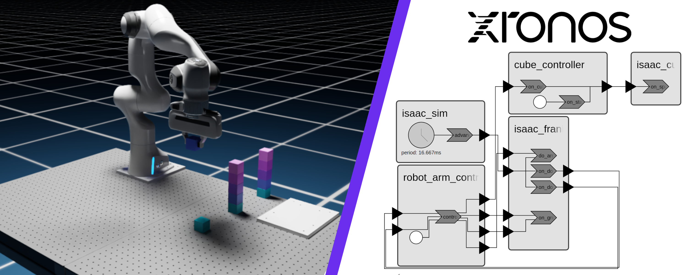
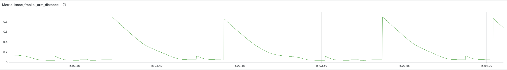

# Isaac Sim Demo

This is a demonstration of how [NVIDIA Isaac Sim](https://developer.nvidia.com/isaac/sim)
can be integrated with the Xronos Python SDK.

## Prerequisites

We assume a working installation of Isaac Sim (> 5.0.0) on a Linux host. Isaac can be
installed and setup in one of the following ways:

- [Manual installation](https://docs.isaacsim.omniverse.nvidia.com/5.1.0/installation/quick-install.html)
- [Docker](https://docs.isaacsim.omniverse.nvidia.com/5.1.0/installation/install_container.html)
- [Cloud Deployment](https://docs.isaacsim.omniverse.nvidia.com/5.1.0/installation/install_cloud.html)

## Overview

The demo creates a Panda Franka robot arm that picks up cubes and stacks them
building multiple stacks. The demo consists of the following reactors:

- **IsaacSim:** This reactor manages the simulation. It sets the `do_step`
  output to inform other reactors that the simulator stopped running and new
  control input should be generated.
- **IsaacCubeGenerator:** Places new cubes for the robot to pick up.
- **IsaacFranka:** Interacts with the simulated Franka robot arm. It receives input from the controller and produces output signals that indicate if the robot has reached its target position.
- **RobotArmController:** Implements the high-level pick and place control algorithm.
- **CubeGeneratorController:** Controls the generation of new cubes.

## Running the Demo

> [!NOTE]
> Isaac Sim ships its own version of Python accessible through the python.sh script.
> Since Isaac is picky about the Python environment, we recommend using this script
> to run all Python commands.


**Installing Xronos**

```bash
python.sh -m pip install xronos[dashboard]
```

`python.sh` refers to the custom python script shipped with Isaac Sim. You might
need to add it to your `PATH` or add the full path to your command.


**Running the Demo**

To run the demo, execute the following command within this directory.

```bash
python.sh -m isaac_demo
```

Optionally, use the `--telemetry` flag to record telemetry data from the demo.

```bash
python.sh -m isaac_demo --telemetry
```

The telemetry data can be viewed in the [Xronos Dashboard](https://docs.xronos.com/dashboard.html) (see next step).

**Starting the Dashboard**

The Xronos Dashboard can be started using the following command:

```bash
python.sh -m xronos_dashboard start
```

Open [localhost:3000](http://localhost:3000) on the machine running the dashboard and
login using `admin` and `xronos`. See the [docs](https://docs.xronos.com/dashboard.html) for more details.

The dashboard will automatically receive data from the demo when executed with the `--telemetry` flag.

**Viewing Metrics**



The program exports several metrics. These include:
- `isaac_franka._arm_distance`: The distance between the current position of the arm end effector and its target position.
- `isaac_franka._gripper_distance`: The distance between the current position of the gripper joints and their target position.
- `isaac_franka._arm_position_reached`: Set to 1 when the arm is in its target position, 0 otherwise.
- `isaac_franka._gripper_position_reached`: Set to 1 when the gripper joints are in their target position, 0 otherwise.
- `robot_arm_controller._cubes_delivered`: The number of cubes delivered so far.

To view a specific metric, select the metric using the drop down menu at the top
of the dashboard. It is also possible to create custom panels using Grafana's
panel editor.

## Next Steps: From Sim to Real

Once you are ready to go beyond a pure simulation demo, the key step is to hook
this same control loop up to a lightweight reactor that accepts the commands
produced by this demo and streams them to your real robot arm, closing the loop
on a true digital twin. This keeps Isaac Sim as the high‑fidelity twin for
iteration and testing while the reactor becomes the bridge into your field
stack, so every behavior you refine in sim is one configuration change away from
running on hardware. If you are interested in wiring up this kind of reactor and
building out a production‑grade digital twin workflow around it, [reach out to
Xronos](https://app.onecal.io/b/xronos/workshop) to learn more about how this
pattern can fit into your existing robotics or automation stack.
