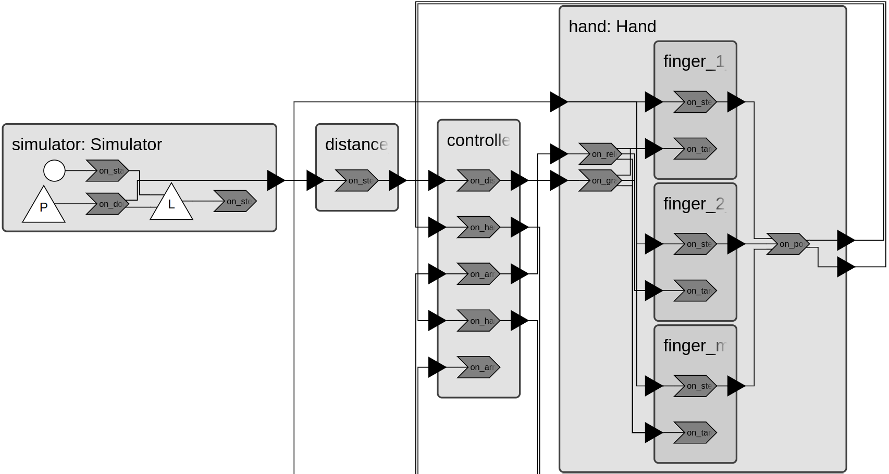
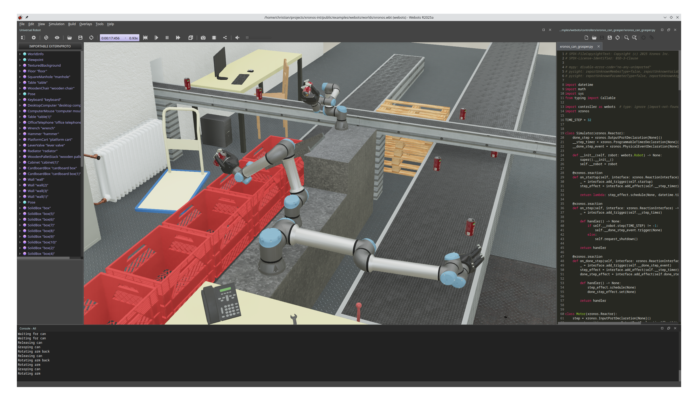

# Webots

This example illustrates how Xronos can integrate with robotics simulators for
software-in-the-loop (SIL) simulation.

## Prerequisites

- xronos python library
- Python 3.10 or later
- Python virtual environment (optional but recommended)
- Webots (see [installation instructions](https://cyberbotics.com/doc/guide/installation-procedure#installation-on-linux)

## Overview

The example provides a complete Webots project. This project is based on the
[Universal Robots demo](https://cyberbotics.com/doc/guide/ure?version=R2022b)
that is part of the [Webots
project](https://github.com/cyberbotics/webots/tree/R2022b/projects/robots/universal_robots).
While the simulated world is still the same, the [origin control
code](https://github.com/cyberbotics/webots/blob/R2022b/projects/robots/universal_robots/controllers/ure_can_grasper/ure_can_grasper.c)
is replaced by a highly-modular and event-based Python program using the Xronos
SDK. The code can be found in `controllers/xronos_can_grasper/xronos_can_grasper.py`.



## Running the Demo

Install the Python dependencies.

```shell
pip install -r requirements.txt
```

Then run webots using the following command.

```shell
webots ./worlds/xronos.wbt
```

[!NOTE]
> Webots will use the first Python binary that it finds on your `PATH`. If you are
> using virtual environments, make sure to run `webots` from a shell that has the
> environment activated.

This opens Webots and the demo starts running immediately.



The bottom panel shows output from the three robot arm controllers. Note that
this might show error messages "Failed to connect to remote host: Connection
refused" in case you are not running the dashboard for collecting telemetry
data. Refer to the [docs](https://docs.xronos.com/dashboard.html) for
instructions on how to run and use the dashboard.
